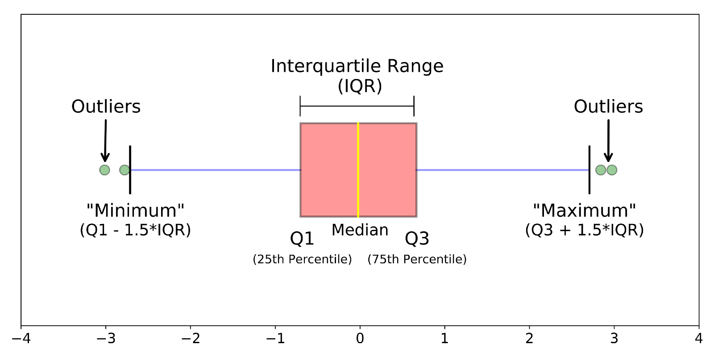

```{r setup, include=FALSE}
knitr::opts_chunk$set(echo = TRUE)
```


## 1.0 Introduction

Data analysis often involves visualization. Some insights that may not be apparent in numbers can come out more easily when visualized. Such visualization can help in coming up with suitable statistical models to automate the task of drawing inferences from data. R has at least three plotting systems (ggplot2 is recommended): 

* **Base Plots**: We can build up a plot in stages from a blank canvas.
* **Lattice Plots**: A plot is created with a single function call. Once plotted, it cannot be modified later. It's easy to create subplots.
* **ggplot2 Plots**: This systems comes with defaults but one can also customize the plots in many ways. It combines elements of both Base and Lattice plotting systems. This is a popular system with good community support and lots of examples.

In this document, we'll discuss only ggplot2, which can be fully customized to make production ready plots. ggplot2 also has the `qplot` command that offers a simpler syntax. Base plots are popular with some researchers for making quick plots for exploratory data analysis. 

To get started, [download and install R](https://cran.r-project.org/). You should also [download and install RStudio](https://www.rstudio.com/). RStudio bundles code editor, console, command history, debugging, documentation and visualization in a single install. Within RStudio, you can check the current version of R by typing the command `version`. Across the R ecosystem, software is delivered as packages. RStudio comes with the `base` package and more.

Additional packages can be installed. You can also list currently installed packages. Here are some examples:

```
# Install package data.table
install.packages("data.table")
 
# List all installed packages with details
installed.packages()

# Use a package
library("data.table")
 
# Find the version
packageVersion("data.table")
```

R packages are usually distributed via [Comprehensive R Archive Network (CRAN)](https://cran.r-project.org/).

Within RStudio, these shortcuts are useful:

* Tab: Autocomplete a command on the console.
* Up/Down Arrow: Navigate the command history to reuse commands.
* Control + Up/Down Arrow: Filter and navigate command history.
* Control + Enter: Execute commands selected in editor.
* Control + L: Clear the console.
* F2: Navigate to the function definition.


## 2.0 Pre-loaded Datasets

R comes with pre-loaded datasets that can be handy for beginners. Beginners can therefore focus on data analysis rather than spend time on importing or cleaning data. We can list all pre-loaded datasets with the command `data()`

For more information on a particular dataset, use the `help` command. Example: `?iris` or `help(iris)`, for help on the *iris* dataset. 

We can obtain basic information about the dataset without doing any plots. We show some examples below. Some of them may not make sense from a data analysis perspective but the commands are included only to show what's possible in R:

```
# Peek into data
str(iris)
head(iris)
tail(iris)

# Names, dimensions, etc.
colnames(iris)
dim(iris)

# Basic stats
colMeans(iris[-5])
colSums(iris[-5])
rowSums(iris[-5])
summary(iris)

# More suitable stats by Species
aggregate(Sepal.Length ~ Species, data=iris, summary)
aggregate(. ~ Species, data=iris, summary)
aggregate(. ~ Species, data=iris, mean)
aggregate(. ~ Species, data=iris, max)
```

Some researchers recommend the use of [DataExplorer](https://cran.r-project.org/web/packages/DataExplorer/index.html) package to partially automate or aid the process of exploratory data analysis. We will not be covering this package but you can study it on your own later.

## 3.0 Scatter Plots

Let's make a few simple plots. We'll start by importing necessary packages.

```{r scatter3.0}
library(datasets)
library(ggplot2)
```

We'll use the `iris` dataset. To interpret the data, it's useful to understand something about the domain. The following picture tells us what's a petal and what's a sepal of an iris flower:


```{r scatter3.1, fig.height=4}
qplot(Sepal.Length, Sepal.Width, data = iris)
qplot(Petal.Length, Petal.Width, data = iris)
```

`qplot()` has a simplified syntax. The equivalent of the above code in `ggplot()` is as follows:

```
ggplot(iris, aes(x=Sepal.Length, y=Sepal.Width)) + geom_point()
ggplot(iris, aes(x=Petal.Length, y=Petal.Width)) + geom_point()
```

Let's say we wish to swap the axes. We can do this using `coord_flip()`. We also show how the initial plot can be saved into a variable and transformed later with further commands:

```{r scatter3.2, fig.height=4}
plen <- ggplot(data=iris, aes(x=Petal.Length, y=Petal.Width))
plen +
  geom_point() +
  coord_flip()
```

A good plot should be self-contained. The measurement units are not clear. There's no title to the plot. Let's add these:

```{r scatter3.3, fig.height=4}
plen +
  geom_point() +
  ggtitle("Iris Petal Size Analysis\nData Source: Anderson (1935)") +
  labs(x="Petal Length (cm)", y="Petal Width (cm)")
```

Let's now customize the above with `theme()`:

```{r scatter3.4, fig.height=4}
ptcolor <- 'grey20' # plot text color
plen +
  geom_point() +
  ggtitle("Iris Petal Size Analysis\nData Source: Anderson (1935)") +
  labs(x="Petal Length (cm)", y="Petal Width (cm)") +
  theme(
    plot.title=element_text(size=14, lineheight=0.8, color=ptcolor, hjust=0.5),
    axis.title.x=element_text(color=ptcolor),
    axis.title.y=element_text(color=ptcolor))
```

Try the following:

* Different values of `hjust` for `element_text()`: 0 (left), 0.5 (center), 1 (right).
* Different colours: a colour can be in RGB format ('#RRGGBB') or a name. All colour names can be obtained using command `colours()`.
* Different values of lineheight: for example, 0.4 makes the title less readable and 2 puts too much space between lines.

It's common practice to create a function to encapsulate the theme and then reuse it across all plots. Individual plots can still be customized for individual plots:

```{r scatter3.5, fig.height=4}
common_theme <- function() {
  ptcolor <- 'grey20' # plot text color
  theme(
    plot.title=element_text(size=14, lineheight=0.8, color=ptcolor, hjust=0.5),
    axis.title.x=element_text(color=ptcolor),
    axis.title.y=element_text(color=ptcolor))
}

plen +
  geom_point() +
  ggtitle("Iris Petal Size Analysis\nData Source: Anderson (1935)") +
  labs(x="Petal Length (cm)", y="Petal Width (cm)") +
  common_theme() +
  theme(plot.title=element_text(color="#2255DD"))
```

The plot of Petal Length vs Petal Width shows at least two obvious clusters of point. Since the dataset has three species of iris flowers, we suspect that this clustering might be due to species differentiation. Let's see if we can visualize each species on its own. Let's do this by customizing the points themselves as part of `geom_point()`:

```{r scatter3.6, fig.height=4}
plen +
  geom_point(shape=iris$Species) +
  ggtitle("Iris Petal Size Analysis\nData Source: Anderson (1935)") +
  labs(x="Petal Length (cm)", y="Petal Width (cm)") +
  common_theme()
```

In the above example, each species is differentiated by shape of the point. You can see the list of shapes in the help for `points()` function. But we don't see any legend to indicate which shape represents which species. Try the following as arguments to `geom_point()`:

* Differentiate by colour: `aes(colour=Species)`
* Increase the size of points: `size=2`
* Multiple customizations: `aes(colour=Species), shape=15, size=1.5`

Note that when we use `aes()` for aesthetics, the legend is displayed automatically. We can now clearly see that the Petal lengths and widths are correlated for all three species but more so in the Setosa species. Let's check the Sepal data.

```{r scatter3.7, fig.height=4}
ggplot(data=iris, aes(x=Sepal.Length, y=Sepal.Width)) +
  geom_point(aes(colour=Species), shape=15, size=1.5) +
  ggtitle("Iris Sepal Size Analysis\nData Source: Anderson (1935)") +
  labs(x="Sepal Length (cm)", y="Sepal Width (cm)") +
  common_theme()
```


## 4.0 Plots for Showing Spread

Scatter plots help us visualize the spread but the spread is not quantitatively summarized. There are some other plots that can tell us about spread.


```{r scatter4.0, fig.height=4}
ggplot(iris, aes(x=Petal.Length)) + geom_histogram()
```

Let's improve this by specifying `binwidth` as argument:

```{r scatter4.1, fig.height=4}
ggplot(iris, aes(x=Petal.Length)) + geom_histogram(binwidth = 0.1)
```

There are obviously two clusters. With the second cluster of longer petals, there appears to be multiple peaks. This is what we call **multimodal distribution**. We already know that this is because there are two species with overlapping petal lengths. We can confirm this by differentiating the species by colour:

```{r scatter4.2, fig.height=4}
ggplot(iris, aes(x=Petal.Length, fill=Species)) + 
  geom_histogram(binwidth = 0.1)
```

Let's do the above for all four measured variables. This is an example of creating subplots within a plot and using `gridExtra` (install it if not installed) to do the layout:

```{r scatter4.3, fig.height=4}
library(gridExtra)

plen <- ggplot(iris, aes(x=Petal.Length, fill=Species)) + 
  geom_histogram(binwidth = 0.1)
pwth <- ggplot(iris, aes(x=Petal.Width, fill=Species)) + 
  geom_histogram(binwidth = 0.1)
slen <- ggplot(iris, aes(x=Sepal.Length, fill=Species)) + 
  geom_histogram(binwidth = 0.1)
swth <- ggplot(iris, aes(x=Sepal.Width, fill=Species)) + 
  geom_histogram(binwidth = 0.1)

grid.arrange(plen, pwth, slen, swth, nrow = 2)
```

We can note from the above plot that Sepal Width doesn't help us in separating the species. Both Petal Length and Petal Width are more useful in this regard.

We can improve the plot by having only one legend. This is [explained on Stackoverflow](https://stackoverflow.com/questions/13649473/add-a-common-legend-for-combined-ggplots). However, there's a simpler way if we transform the data:

```{r scatter4.4, fig.height=6}
library(reshape2)

miris <- melt(iris, id=c("Species"))
colnames(miris) <- c("Species", "Trait", "Value")
ggplot(miris, aes(x=Value, fill=Species)) + 
  geom_histogram(binwidth = 0.1) +
  facet_grid(Trait ~ .) +
  theme(legend.position = "bottom")
```

As a variation, we can do a density plot instead of a histogram. Note the use of `get()` within `aes()` when a variable is used:

```{r scatter4.5, fig.height=4}
common_subplot <- function(data, field) {
  ggplot(data, aes(x=get(field), fill=Species)) +
  geom_density(alpha=0.4) +
  labs(x=field, y="Density")
}

plen <- common_subplot(iris, "Petal.Length")
pwth <- common_subplot(iris, "Petal.Width")
slen <- common_subplot(iris, "Sepal.Length")
swth <- common_subplot(iris, "Sepal.Width")

grid.arrange(plen, pwth, slen, swth, nrow = 2)
```

Another type of plot showing spread is the box plot:

```{r scatter4.6, fig.height=4}
ggplot(iris, aes(x=Species, y=Petal.Length)) + 
  geom_boxplot(width=0.5) +
  coord_flip()
```

Refer to the following figure for interpreting the box plot:



In the following example we show the mean within the boxplot:

```{r scatter4.7, fig.height=4}
ggplot(iris, aes(x=Species, y=Petal.Length)) + 
  geom_boxplot(width=0.5) +
  coord_flip() +
  stat_summary(fun.y="mean", geom="point", shape=23, size=3, fill="white")
```

An alternative to the box plot is the violin plot, where width is proportional to frequency of occurence:

```{r scatter4.8, fig.height=4}
ggplot(iris, aes(x=Species, y=Petal.Length)) + 
  geom_violin() +
  stat_summary(fun.y="mean", geom="point", shape=23, size=3, fill="white")
```

We can combine a violin plot with a box plot:

```{r scatter4.9, fig.height=4}
ggplot(iris, aes(x=Species, y=Petal.Length)) + 
  geom_violin(trim=FALSE) +
  geom_boxplot(width=0.1) +
  stat_summary(fun.y="mean", geom="point", size=1.5, color="red") +
  coord_cartesian(ylim = c(0, 10))
```


## 5.0 Line Plots

Let's try a few line plots. We'll use *AirPassengers* to start with.

```{r scatter5.0, fig.height=4}
mths <- seq(as.Date("1949/1/1"), as.Date("1960/12/31"), by = "months")
airp <- data.frame(Year=mths, PassengerCount=AirPassengers)
qplot(Year, PassengerCount, geom="line", data = airp)
```

```{r scatter5.1, fig.height=4}
qplot(Year, PassengerCount, geom="line", data = airp) +
  scale_x_date(date_breaks = "4 month", date_labels =  "%b %Y") +
  theme(axis.text.x=element_text(angle=90, hjust=1))
```

The plot above shows how air traffic has increased over the years. The seasonal variation that peaks in summer is also apparent. Let's ignore the seasonal variation and analyze based on annual sums:

```{r scatter5.2, fig.height=4}
library(data.table)

summer <- aggregate(PassengerCount ~ year(Year), data=airp, sum)
colnames(summer) <- c("Year", "PassengerCount")
qplot(Year, PassengerCount, geom=c("point","line"), data = summer) +
  theme(panel.grid.minor.x = element_blank()) +
  scale_x_continuous(breaks=seq(1948,1961,1))
```

Try removing `theme()` and `scale_x_continuous()` in the above code and understand their effect. The `ggplot` alternate to the above code is here along with additional customization:

```{r scatter5.3, fig.height=4}
ggplot(data = summer, aes(x=Year, y=PassengerCount)) +
  geom_line(linetype=2, color="grey20") +
  geom_point(color="red") +
  theme(panel.grid.minor.x = element_blank()) +
  scale_x_continuous(breaks=seq(1948,1961,1))
```

For an area plot, use `geom_area()` instead of `geom_line()`. For example, try `geom_area(fill="pink")`.

Let's try a stacked area plot by segmenting the data by month of travel:

```{r scatter5.4, fig.height=4}
mairp <- airp
mairp$Month <- as.factor(month(mairp$Year))
mairp$Year <- year(mairp$Year)
mairp <- melt(mairp, id=c("Year","Month", "PassengerCount"))
ggplot(mairp, aes(x=Year, y=PassengerCount, fill=Month)) + geom_area()
```

Let's try a different plot, a proportional stacked area plot. We see that the proportions are almost constant across the years. One exception is July 1953, when proportionally more people travelled than in other months of that year. We've also improved the legend with month names rather than just numbers.

```{r scatter5.5, fig.height=4}
library(reshape2)

yearSums <- dcast(mairp, Year~., sum, value.var = "PassengerCount")$.
mairp$Percent <- 100 * mairp$PassengerCount / rep(yearSums, each=12)
levels(mairp$Month) <- month.abb
ggplot(mairp, aes(x=Year, y=Percent, fill=Month)) +
  geom_area() +
  theme(panel.grid.minor.x = element_blank()) +
  scale_x_continuous(breaks=seq(1948,1961,1))
```


## 6.0 Bar Plots

One of the pre-loaded dataset is of the Titanic disaster. Let's analyze this using bar plots. We start with a simple bar plot of those who survived.

```{r scatter6.0, fig.height=4}
ttc <- data.frame(Titanic)
ggplot(ttc[ttc$Survived=="Yes",], aes(x=Class, y=Freq)) +
  geom_bar(stat="identity")
```

We can see that more crew members survived than 1st class passengers. However, this gives an incomplete picture. We need to include those who didn't survive. When we do this, we find that most crew members didn't survive. It's obvious that 1st class passengers got preferential treatment.

```{r scatter6.1, fig.height=4}
ggplot(ttc, aes(x=Class, y=Freq, fill=Survived)) +
  geom_bar(stat="identity", position="dodge") +
  geom_text(aes(y=Freq, label=Freq), 
    vjust=1.5, position=position_dodge(.9), colour="white")
```

The above plot has a problem. Multiple numbers are shown within each bar. This indicates that there are multiple data points that need to be aggregated:

```{r scatter6.2, fig.height=4}
attc <- aggregate(. ~ Class+Survived, data=ttc, sum)
ggplot(attc, aes(x=Class, y=Freq, fill=Survived)) +
  geom_bar(stat="identity", position="dodge") +
  geom_text(aes(y=Freq, label=Freq), 
    vjust=1.5, position=position_dodge(.9), colour="white")
```

We can visualize with a stacked bar plot:

```{r scatter6.3, fig.height=4}
ggplot(attc, aes(x=Class, y=Freq, fill=Survived)) +
  geom_bar(stat="identity") +
  geom_text(aes(y=Freq, label=Freq),
    position = position_stack(vjust = 0.5), colour="white")
```

We can repeat this with a stacked percent bar plot. We see that only 25% of 3rd class and crew survived while this is above 60% for 1st class passengers.

```{r scatter6.4, fig.height=4}
ggplot(attc, aes(x=Class, y=Freq, fill=Survived)) +
  geom_bar(stat="identity", position="fill")
```

Is there a difference between men and women? Let's find out:

```{r scatter6.5, fig.height=4}
attc <- aggregate(. ~ Class+Survived+Sex, data=ttc, sum)
ggplot(attc, aes(x=Sex, y=Freq, fill=Survived)) +
  geom_bar(stat="identity") +
  facet_grid(~Class) +
  geom_text(aes(y=Freq, label=Freq),
    position = position_stack(vjust = 0.5), colour="white")
```

We can see that 1st and 2nd class female passengers got priority. A deviation is 3rd class female passengers: more died than survived. In all classes, more male passengers died than survived in that class.

Try the following:

* Analyze by Age and Class: use `attc <- aggregate(. ~ Class+Survived+Sex+Age, data=ttc, sum)` and `facet_grid(Age~Class, scales="free_y")`
* Plot horizontal bars rather than vertical bars.
* Adjust width of bars and spacing between bars.
* Give non-default colours to the bars.


## 7.0 Further Reading

The following study links will improve your understanding of ggplot2:

* [STHDA. ggplot2 - Essentials.](http://www.sthda.com/english/wiki/ggplot2-essentials)
* [STHDA. qplot: Quick plot with ggplot2](http://www.sthda.com/english/wiki/qplot-quick-plot-with-ggplot2-r-software-and-data-visualization)
* [Hamelg. 2015. Introduction to R Part 20: Plotting with ggplot2.](http://hamelg.blogspot.com/2015/08/introduction-to-r-part-20-plotting-with.html)
* [Kassambara. 2017. ggplot2 - Easy Way to Mix Multiple Graphs on The Same Page.](http://www.sthda.com/english/articles/24-ggpubr-publication-ready-plots/81-ggplot2-easy-way-to-mix-multiple-graphs-on-the-same-page/)
* [Winston Chang. 2012. R Graphics Cookbook, O'Reilly Media.](http://shop.oreilly.com/product/0636920023135.do)
* [Zev Ross. 2014. Beautiful plotting in R: A ggplot2 cheatsheet.](http://www.cs.utexas.edu/~cannata/dataVis/Class%20Notes/Beautiful%20plotting%20in%20R_%20A%20ggplot2%20cheatsheet%20_%20Technical%20Tidbits%20From%20Spatial%20Analysis%20&%20Data%20Science.pdf)
* [BBC. 2019. BBC Visual and Data Journalism cookbook for R graphics.](https://bbc.github.io/rcookbook/)
