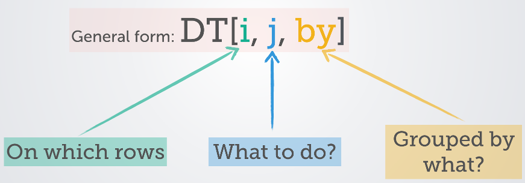

```{r setup, include=FALSE}
knitr::opts_chunk$set(echo = TRUE)
```

## Introduction

R comes from a programming language named S+, which itself was based on S that was invented in Bell Labs in 1976. First public release of R happened in 1993. It has hundreds of statistical packages. The language is free to download, execute, adapt and redistribute. There's strong community support. It has strong graphing capabilities and suited for interactive data analysis. Among the problems with R are security (was not designed for web apps) and memory management (all objects need to be stored in physical memory).

To get started, [download and install R](https://cran.r-project.org/). You should also [download and install RStudio](https://www.rstudio.com/). RStudio bundles code editor, console, command history, debugging, documentation and visualization in a single install. Within RStudio, you can check the current version of R by typing the command `version`. Across the R ecosystem, software is delivered as packages. RStudio comes with the `base` package and more. Additional packages can be installed. You can also list currently installed packages. Here are some examples:

```
# Install package data.table
install.packages("data.table")
 
# List all installed packages with details
installed.packages()
 
# List all installed packages
library()
 
# Get help on base package
library(help = "base")
 
# Update or remove package
update.packages("data.table")
remove.packages("data.table")
 
# Use a package
library("data.table")
 
# Find the version
packageVersion("data.table")
```
R packages are usually distributed via [Comprehensive R Archive Network (CRAN)](https://cran.r-project.org/).

Within RStudio, these shortcuts are useful:

* Tab: Autocomplete a command on the console.
* Up/Down Arrow: Navigate the command history to reuse commands.
* Control + Up/Down Arrow: Filter and navigate command history.
* Control + Enter: Execute commands selected in editor.
* Control + L: Clear the console.
* F2: Navigate to the function definition.

Here are some ways to get help: 

```
# Two ways of getting help on function str
?str
help(str)
 
# Get help on only the arguments or examples of function dim
args(dim)
example(dim)
 
# Search all help pages for a given phrase
help.search("linear regression")
```

Here are some simple function calls for you to try:

```
ls()                         # list all R objects in current environment
dir()                        # display content of current directory
getwd()                      # display path of current working directory
setwd("example1/data")       # change the working directory with relative path
source("main.R")             # execute the named R script
```

## Data Types

R has the following basic types that are called atomic types: 


* `logical`: Can take value TRUE or FALSE.
* `integer`: Specified with suffix 'L'. Eg. 23L, -4L
* `numeric`: Specified as a number without suffix. Eg. 23, -4, 2.12
* `complex`: Complex numbers. Eg. 2+3i, -3-5i
* `character`: Strings are specified as a sequence of characters.
* `raw`: Raw bytes.


Among the data types are the following: 

* `vector`: Contains a sequence of items of the same type. Type is also called a mode in the context of vectors. This is most basic type. Items of a vector can be accessed using [].
* `list`: Represented as a vector but can contain items of different types. Different columns can contain different lengths. Items of a list can be accessed using [[]]. This is a recursive data type: lists can contain other lists.
* `array`: Vectors with attributes dim and dimnames.
* `matrix`: A two-dimensional array.
* `data.frame`: While all columns of a matrix have same mode, with data frames different columns can have different modes. This can be considered a type of list where all columns have same length.
* `factor`: Roughly equivalent to an "enum" type in C, factor represents a finite set of values. We may also call factors as categories or enumerated types. It's also possible to specify an order for factors.

Note that lists and data frames are heterogenous whereas the rest are homogeneous. Try out the following examples. Note that `<-` is used as assignment operator in R. `TRUE` and `FALSE` can also be written as `T` and `F` respectively. Vectors and lists have `names` whereas matrix objects have `dimnames`. Columns can be accessed by names using the dollar syntax `$` for lists and data frames.

```
# Some examples of vector
a <- c(1L, -2L)                  # create a vector of two integers, c implies combining values into a vector
a                                # display the vector
str(a)                           # display the structure of the object, useful for large objects
class(a)                         # display the class of the object: will display same as typeof
typeof(a)                        # display the internal mode of the object
storage.mode(a)                  # display the internal mode of the object
mode(a)                          # similar to typeof() with some differences
a.copy <- a                      # variable names can contain dots
 
c(1, 2.0, 0.3)                   # create a numeric vector
c("a", "bc", "def")              # create vector of character
c(1, 0.3, 2L, "xyz")             # coercion to a single mode: character
 
v1 <- vector(length=4)           # create a vector of length 4 of logical mode
length(v1)                       # display length of vector
c(1:10)                          # vector of 10 
c(1:10)*2 - 1                    # vector of first 10 odd positive numbers (not integer)
c(1:5, 11:15)                    # vector of non-contiguous integers (not numeric)
 
# Scalar variables can be differentiated from vectors using str but not class
a <- 3
str(a)
class(a)
a <- c(3,4)
str(a)
class(a)                         # same output as scalar
 
# Some examples of matrix
matrix(1:6, nrow=2, ncol=3)                    # create a matrix
matrix(c(1:3, 10L, 11L, 12L), nrow=2, ncol=3)  # values coerced to numeric mode
m1 <- matrix(1:6, nrow=2, ncol=3, byrow=T)     # create a matrix by filling rows first
dim(m1)
colnames(m1) <- c("a", "b", "c")
rownames(m1) <- c("u", "v")
dimnames(m1)
nrow(m1)                                       # no. of rows
ncol(m1)                                       # no. of columns
m1["u",]                                       # display named row
m1[1,]                                         # display 1st row
m1[,"a"]                                       # display named column
m1[,2]                                         # display 2nd column
m1[,c(1,3)]                                    # display 1st and 3rd columns
cbind(m1, d=c(7,8))                            # append a new column
rbind(w=c(7,8,9), m1)                          # prepend a new row
attributes(m1)                                 # display the attributes of the object
dim(m1) <- c(3, 2)                             # resize the matrix
length(m1)                                     # works like in a vector
m1[1]                                          # works like in a vector
 
# Conversion between vector and matrix
ten <- 1:10
matrix(ten, nrow=2)                            # vector to matrix, vector not changed
ten
dim(ten) <- c(2,5)                             # vector to matrix in-place
ten
as.vector(ten)                                 # matrix to vector, matrix not changed
ten
dim(ten) <- c(1,10)                            # remains a matrix with modified dims
 
# Some examples of array
a1 <- array(1:5, c(2,4,3))                     # create array of 3 dimensions, recycle 1:5
a1 <- array(1:24, c(2,4,3))                    # create array of 3 dimensions
length(a1)                                     # works like in a vector
a1[24]                                         # works like in a vector
dimnames(a1) <- list(c("a", "b"),              # assign names
                     c("u", "v", "w", "x"), 
                     c("p", "q", "r"))
dimnames(a1)                                   # display dimension names
a1["a",,]                                      # display "a" values
a1[,"u","r"]                                   # display "u" and "r" values
a2 <- 1:100                                    
dim(a2) <- c(10, 5, 2)                         # Transform the vector into a 3-D array
class(a2)
a2[,1,]
 
# Some examples of factor
gender <- factor(c(rep("male", 5),                 # rep is used to repeat a value
                   rep("female", 8)))
levels(gender)                                     # levels are in alphabetic order
gender <- factor(gender, ordered=T)                # levels are ordered
levels(gender)                                     # levels are in alphabetic order
gender[gender < "male"]                            # possible when levels are ordered
gender <- factor(gender,                    
                 ordered=T,
                 levels=c("male", "female"))       # explicitly specify a different order
gender
levels(gender) <- c("female", "male")              # has the effect of swapping the levels
gender
 
# Some examples of list
list(1, "a", TRUE, 1+4i)                       # a list of varied modes
rl <- list(list(1:4), list("a","b", 3))        # a list can contain other lists
is.recursive(rl)
mylist <- list(idx = c("a", "b"),              # create a list with two named columns
               values = c(10, 12.1, 14, 12))
mylist$idx                                     # display column named idx
mylist[["idx"]]                                # display column named idx
mylist[[1]]                                    # display 1st column
mylist$values                                  # display column named values
mylist$idx[2]                                  # display 2nd item of idx column
mylist[[2]][[1]]                               # display 1st item of 2nd column
mylist[[2]][1]                                 # display 1st item of 2nd column
mylist[[c(2,1)]]                               # display 1st item of 2nd column
mylist[c(2,1)]                                 # display 2nd column, then 1st column
names(mylist)                                  # display names of list object (column names)
names(mylist) <- c("x", "y")                   # change names of list object (column names)
mylist$extra <- c(1:4)                         # add another column
 
# Use of attach() and detach()
mylist <- list(idx = c("a", "b"),              # create a list with two named columns
               values = c(10, 12.1, 14, 12))
attach(mylist)
idx                                            # can access directly by column name due to attach()
detach()
mylist$idx                                     # once detached, need to access via R object
```

R was created more by statisticians rather than computer programmers. For this reason, the language is closer to mathematical conventions. For example, indexing in R starts from 1, not 0. Most languages will throw an exception if a positive number is divided by zero. In R, the result is correctly infinity. Here are a few examples: 

```
z <- c(-1, 1)
inf <- z / 0                                   # results in -Inf and -Inf
inf / inf                                      # results in NaN (not a number)
inf * inf                                      # results in Inf
0 / 0                                          # results in NaN
is.na(0 / 0)                                   # NaN is also considered NA
1 / inf                                        # results in zeros
c(z[1], z[2])                                  # shows that indexing starts from 1
```

## Operators, Control Structures and Functions

Here are some basic operations we can do on data: 

```
v1 <- c(1:5)
 
# Some examples showing arithmetic operations
v1 + 2                   # value 2 is recycled for the entire vector
v1 + c(2, 3)             # values are recycled for the entire vector
v1 + v1                  # element-wise addition
v1 - 2                   # element-wise subraction
 
v1 / 2                   # element-wise division
v1 %/% 2                 # integer division, retain only integer part
v1 / v1                  # element-wise division
v1 * 2                   # element-wise multiplication
v1 ^ 2                   # exponential operator, can alternatively use **
v1 %% 2                  # modulo operator
 
m1 <- matrix(1:6, nrow=2, ncol=3, byrow=T)
m1 + m1                  # matrix element-wise addition
m1 * m1                  # matrix element-wise multiplication
m1 %*% t(m1)             # matrix multiplication of m1 with its transpose
 
m1 <- matrix(c(1:4, 11:15), nrow=3)
m1inv <- solve(m1)       # get inverse of matrix
m1 %*% m1inv             # result is an identity matrix
 
# Some examples showing logical operations
v1 > 2
v1 <= 2
!(v1 <= 2)
v1 == 2
v1 != 2
v1 > 2 | v1 < 4
v1 > 2 & v1 < 4
```

For control structures, we have `if-else`, `for` loops, `while` loops, `repeat` loops. Also available are `ifelse` and `switch`. Here are some examples: 

```
# Example of a for loop and if-else
for (val in 1:10) {
    if (val %% 2 == 0) {
        next
        print(paste(val, "is an even number.")) # this will not be printed
    }
    else if (val > 5) {
        print(paste(val, "is an odd number greater than 5."))
        break
    }
    else {
        print(paste(val, "is an odd number less than or equal to 5."))
    }
}
 
# Example of a while loop
names <- c("Manoj", "Anjali", "Poonam", "Kumar", "Gautam")
needle <- "Poonam"
i = 1
foundAt = 0
while (foundAt == 0) {
    if (names[i]==needle) {
        foundAt = i
    }
    i = i + 1
}
print(paste("Found at index", foundAt))
 
# Repeat is an infinite loop used with a break
i = 1
repeat {
    if (names[i]==needle) {
        foundAt = i
        break
    }
    i = i + 1
}
print(paste("Found at index", foundAt))
 
# Example showing the use of ifelse
grades <- c(55, 65, 43, 67, 22, 83)
ifelse(grades >= 50, "pass", "fail")
 
# Without ifelse, this would be the long way
results <- grades >= 50                        # get a logical vector
results[results] <- "pass"                     # also coerces to character vector
results[results=="FALSE"] <- "fail"             
 
# Example showing the use of switch
# C: 0-24, B: 25-49, A: 50:74, A+: 75-100
for (g in ceiling(grades/25)) {
    print(switch(g, "C", "B", "A", "A+"))
}
```

R has a number of built-in functions. We have already seen some of these. The following example shows how to create a user-defined function. A function will implicitly return the result of the last expression. We can instead choose to do an explicit return. 

```
# A function that takes 3 arguments
# Two arguments have default values
adder <- function(a, b=3, c=1) {
    a + b*c
}
adder(1:4)                 # use defaults for b and c
adder(1:4, 4)              # b=4 and use default for c
adder(1:4, c=2)            # c=2 and use default for b
adder(c=2, 10, 1:4)        # a=10 and b=1:4
 
# Adder redefined with explicit return
adder <- function(a, b=3, c=1) {
    return(a + b*c)
}
 
# Yet another way to return
adder <- function(a, b=3, c=1) {
    z <- a + b*c
    return(z)
}
 
# Can define a function within a function
# Scope limited to outer function
adder <- function(a, b=3, c=1) {
    mult <- function(b, c) {
        b*c
    }
    return(a + mult(b,c))
}
```

## Working with Data

Vectors are so important that programmers need a good foundation working with them. Here are some examples using vectors: 

```
v1 <- c(10:12, 1:5, -3:0)
rev(v1)                               # reverse items of the vector
sort(v1)                              # sort the vector
v1 <- c(v1, c(88, 99))                # append items to vector
seq(0, 1, 0.1)                        # create a vector using seq
seq(1, 10, along=v1)                  # divide the interval [1,10] into length(v1) parts
seq(1, 10, length=8)                  # divide the interval [1,10] into 8 parts
v1[c(T, F)]                           # pick alternative items
v2 <- v1                              # copy the vector
v1[!(v1 %in% 1:5)] <- -99             # replace all values not in range [1,5] with -99
v2[v2 %% 3 == 1]                      # pick every third element using a logical vector
v2[which(v2 %% 3 == 1)]               # pick every third element: which() obtains indices
v2[seq(1, length(v2), by=3)]          # pick every third element using indices
 
# Obtain subsets of a vector
v1[1]
v1[2:5]
v1[c(1:3, 5, 7)]                      # note that vectors can be used as indices for subsetting
 
# Filter a vector
v1 > 4                                # get a logical vector satisfying the condition  
v1[v1 > 4]                            # get items greater than 4
v1[-1]                                # get a vector but ignore 1st element
v1[c(-1,-length(v1))]                 # get a vector but ignore 1st and last elements
 
# Coercion in this order: logical -> integer -> numeric -> complex -> character
c(T, F, 0, 1)                         # coercion to integer
c(T, F, 0, 1, 1.2)                    # coercion to numeric
c(T, F, 0, 1, 1.2, 1+2i)              # coercion to complex
c(T, F, 0, 1, 1.2, 1+2i, "a")         # coercion to character
as.logical(c(T, F, 0, 1))             # explicit coercion to logical
as.integer(c(T, F, 0, 1, 1.2, 1+2i))  # explicit coercion to integer: decimal and imaginary parts discarded
1 == T                                # implicit coercion
1 < "2"                               # implicit coercion to character
11 < "2"                              # implicit coercion to character, hence result is TRUE
11 < as.integer("2")                  # explicit coercion to integer
 
# Random number generation and sampling
rn <- rnorm(1:10, mean=5, sd=2)       # create a vector of 10 values from a normal dist.
sample(20:25, size=8, replace=T)      # get a sample of 8 values in range [20,25]
sample(letters, size=5)               # get 5 random letters
 
# Combinations
choose(8, 2)                          # combinations of 2 items from 8
combn(LETTERS[1:8], 2)                # get the combinations
 
# Permutations
library(gtools)
permutations(8, 2, LETTERS[1:8])      # get the permutations of 2-item sets from 8
```

The other data type that's important is `data.frame`. It's two-dimensional of equal-length vectors but each vector can contain a different data type. Thus, `data.frame` is somewhat a cross between matrix and list. Tabular data is best stored as a data frame. 

```
data.frame(a = c("x","y","z"), b = 1:3, c = T)             # create a data frame directly
m1 <- matrix(1:9, 3, 3, 
             dimnames = list(NULL, c("a", "b", "c")))
cbind(m1, d = c(T, F, F))                                   # will result in a matrix after coercion to integer
df <- cbind(data.frame(m1), d = c(T, F, F))                 # convert matrix to data.frame and add column
df$a                                                        # display column named "a"
df[c("a", "d")]                                             # display columns "a" and "d"
df$z <- df$a + df$b                                         # create a new column from two other columns
df[1,]                                                      # display row 1 as a data.frame
df[1]                                                       # display column 1 as a data.frame
df[,1]                                                      # display column 1 as a vector
df[c(2,3,4,1,5)]                                            # display columns in a different order
ddf <- df[c("c","a","b","b")]                               # reorder columns plus repeat column "b"
names(ddf)                                                  # extra column will have name "b.1"
names(ddf)[4] <- "d"                                        # rename the extra column
df$c[1] <- 0                                                # change a specific item
df[df$b %in% c(4,6),]                                       # display rows if "b" column has value 4 or 6
d[!(names(d) %in% c("a"))]                                  # display all columns except "a"
 
d <- data.frame(a=1:5, b=6:10, c=11:15)
d$b[c(1,3)] <- NA                                           # set couple of elements to NA
sum(is.na(d$b))                                             # count of NA values
any(is.na(d$b))
all(is.na(d$b))
d[d$a %in% c(4,2),]                                         # use logical vector to subset
d[(d$a>3 | d$c>6),]                                         # subset by conditions: condition returns logical vector
d[(d$a>3 & d$c>6),]
d[with(d, a>3 & c>6),]                                      # use names as if they are variables
subset(d, a>3 & c>6, select=c("a", "c"))                    # use subset() function and display selected columns
d[which(d$b>7),]                                            # use which() when some values are NA: which() returns indices
sort(d$b, na.last=T)                                        # NA values are retained and come at the end
d[order(-d$c),]                                             # descending order by column c values
d$d <- c(5,6,5,6,5)
d[order(d$d,-d$a),]                                         # ascending order by d, then descending order by a
data.matrix(d)                                              # convert to matrix via coercion
cbind(rbind(d, d), e = c(8, 9))                             # value 8 and 9 are recycled to make a full column
d$d <- NULL                                                 # delete column d
 
a <- data.frame(id=1:5, bid=3:7, value=rnorm(5))
b <- data.frame(id=3:7, value=rnorm(5), err=rnorm(5))
merge(a, b, by.x="bid", by.y="id", all=T)                   # merge from multiple datasets
intersect(names(a), names(b))
 
data.frame(x = 1:3, y = matrix(1:9, nrow = 3))              # create data.frame from a list and a matrix
df <- data.frame(x = 1:3)
df$y <- list(1:2, 1:3, 1:4)                                 # add a column containing lists, each of different length
data.frame(x = 1:3, y = I(list(1:2, 1:3, 1:4)))             # I() to treat list as one unit, not separate columns
```

Package `data.table` is similar to `data.frame` but offers better syntax and performance. Likewise, `dplyr` is a complementary package that has clean syntax and interfaces nicely with other R packages. Below are examples showing the use of `data.table`: 



```
library("data.table")
 
DT <- data.table(ID = c("b","b","b","b","a","a","c"), A = 1:7, B = 7:13, C = 14:20)
 
# append a new column
DT[, D:=C+10]
DT
 
# aggregation and in some cases add new columns; [i, j, by]
DT[, sum(C+D)]
DT[, sum(C+D), by=ID]
DT[, .N, by=ID]                            # histogram (count) by ID
DT[, .N, by=.(ID,A)]                       # .() for when multiple columns are involved
DT[, .(.N, Z=sum(B+C)), by=.(ID,A)]
DT[, .(.N, sum(B+C)), by=.(ID,A)]          # as above but column name autogenerated
DT[, sum((C+B)>23), by=ID]                 # count of records with (C+B)>10 and aggregate by ID
DT[, sum((C+B)>23), .N]                    # total count matching the expression
DT[, .(ma=mean(A), md=mean(D))]
DT[, .(ma=mean(A), md=mean(D)), by=ID]
DT[A%%2!=0, .(ID,A,C,D,B)]                 # only rows matching a condition, reorder columns
DT[A%%2!=0, .(A,C,D,B), by=ID]             # by=ID has no effect since there is no aggregation
DT[A%%2!=0, sum(A+B+C+D), by=ID]
DT[A%%2!=0, .(A,C,D,B), keyby=.(ID)]       # sort after aggregration
DT[A%%2!=0, .(A,C,D,B), keyby=.(ID,-C)]    # sort by ascending ID, descending C
DT[A%%2!=0, .(A,C,D,B), keyby=.(-ID,C)]    # error: cannot do negative of character type: use order()
DT[, .N, .(B<10,D>25)]                     # by can accept expressions, not just columns
DT[A%%2!=0, .(A,C,D,B), keyby=.(X=A>3)]    # give name X to the key
DT[A%%2!=0, .(A,C,D,B), 
   keyby=.(X=A>3,Y=C%%3)]
 
# aggregration by using .SD: subset of data
DT[, print(.SD), by=ID]
DT[, lapply(.SD, mean), by=ID]
DT[, lapply(.SD, sd), by=ID]               # standard deviation will return NA when there is only one sample
DT[ID!="c", lapply(.SD, sd), by=ID]        # ignore row "c"
DT[, lapply(.SD, max), by=ID, 
   .SDcols=c("A","B")]                     # only some columns
DT[, head(.SD, 1), by=ID]                  # only 1st row of each group
DT[, .(val = c(A,B)), by=ID]               # concatenate A and B by ID
DT[, .(val = list(c(A,B))), by=ID]         # concatenate and return as list
 
# returns a vector
ccol <- DT[,C]
c(class(ccol), ccol)
 
# returns a data.table
ccol <- DT[,list(C)]
c(class(ccol), ccol)
ccol <- DT[,.(C)]                          # dot is an alternative to list
c(class(ccol), ccol)
ccol <- DT[,.(aa=A,cc=C)]                  # multiple columns and rename
c(class(ccol), ccol)
 
# returns a data.table by traditional data.frame syntax
ccol <- DT[, c("A","C"), with=F]
c(class(ccol), ccol)
ccol <- DT[, !c("A","C"), with=F]          # all columns except A and C
c(class(ccol), ccol)
 
# subsetting rows
DT[DT$ID=="b",]                            # using comma with data.table is accepted though not necessary
DT[ID=="b"]                                # comma not required as in data.frame, ID can be used instead of DT$ID
DT[1:2]                                    # first two rows
 
# ordering
DT[order(ID,-B)]                                          # ascending ID, descending B
DT[A%%2!=0, .(A,B,Z=sum(C+D)), by=ID][order(-Z,ID)]       # shows chaining of operations using [][]...
```

Those new to R but coming from SQL background, may want to analyze data using SQL commands. R allows this via the package `sqldf`. Here's one example: 

```
# Query using MySQL commands
library(sqldf)
df <- data.frame(a=LETTERS, b=1:26, c=rnorm(26))
sqldf("select * from df where c > 1 order by c desc")
```

Often we wish to apply the same operation over a set of vectors. A typical way would be to use a `for` or `while` loop. R has some functions to simplify this process: `apply`, `lapply`, `sapply`, `tapply`, `mapply`, `aggregate`. For example, a function may accept only a vector as an argument but we want to apply the function to an entire matrix. In this case, these functions are handy. The general strategy is one of _split-apply-combine_, whereby the data is split into multiple parts, the parts are processed and the results are then combined. In general, these functions can be used when the order of processing is not important. Otherwise, you should stick to the traditional loops. Some examples are shown below: 

```
# Some examples with list
lst <- list(a=1:5, b=10:13, c=22:30)                  # start with a list
mean(lst$a)                                           # find mean of a particular column
lapply(lst, mean)                                     # lapply for lists: call mean on each of the column
sapply(lst, mean)                                     # similar to lapply but give a simplified output
 
# Example of sapply and switch:
# earlier we used a for loop to do this
grades <- c(55, 65, 43, 67, 22, 83)
sapply(ceiling(grades/25), switch, "C", "B", "A", "A+")
 
# Some examples with matrix
m1 <- matrix(1:25, nrow=5)
apply(m1, 1, sum)                                     # sum elements row-wise
apply(m1, 2, sum)                                     # sum elements column-wise
apply(m1, 2, mean)                                    # mean of elements column-wise
m1[row(m1)==col(m1)] <- NA                            # set all diagonal elements to NA
apply(m1, 2, mean)                                    # mean will be NA
apply(m1, 2, mean, na.rm=T)                           # pass an argument to mean function
 
# Some examples with array
a1 <- array(1:100, c(2,10,5))                         # array of dimensions 2 x 10 x 5
apply(a1, 1, sum)                                     # 1st dim sum, result is a vector of length 2
apply(a1, 2, sum)                                     # 1st dim sum, result is a vector of length 10
apply(a1, 3, sum)                                     # 1st dim sum, result is a vector of length 5
apply(a1, c(1,2), sum)                                # sum along 1st and 2nd dim, result is a matrix of dim 2 x 10
 
# Some examples of mapply, a multivariate version of lapply
list(rep(1,4), rep(2,3), rep(3,2), rep(4,1))          # create a list
mapply(rep, 1:4, 4:1)                                 # a simpler syntax to create the same list
mapply(rnorm, 3:4, c(1,5), c(0.1,1))                  # two list of random variables with different mean and sd
 
# Some examples of tapply to transform data and then apply
rnd <- rnorm(30)
tapply(rnd, gl(3,10), mean)                           # apply mean to factor levels returned by gl(), returns array
sapply(split(rnd, gl(3,10)), mean)                    # equivalent to using tapply(), returns vector
lapply(split(rnd, gl(3,10)), mean)                    # equivalent to using tapply(), returns list
```

## Working with Files

R offers many ways to read data from files in many formats. It's common to read data into `data.frame` type. Reading data into `data.table` type is more suitable for large datasets. Here are a couple of examples: 

```
# Download file from URL if not already downloaded
if (!file.exists("atheletes.csv"))
    download.file("https://raw.githubusercontent.com/flother/rio2016/master/athletes.csv", 
                  "atheletes.csv", method="curl", quiet=T)
 
# Read from file into a data.frame
dat <- read.csv("atheletes.csv")
 
# Read from file into a data.table (assuming that data.table package is installed)
library("data.table")
dat <- fread("atheletes.csv")
 
# Read only two columns from file into a data.table
dat <- fread("atheletes.csv", sep = ",", header = TRUE, stringsAsFactors = TRUE, select=c("name","IOC"))
 
# Save R objects into file and restore them later
x <- 1:10
y <- LETTERS[1:10]
save(x, y, file = "backup.RData")
rm(x)
rm(y)
load(x, y, file = "backup.RData")
```

## Basic Data Analysis

R comes with pre-loaded datasets that can be handy for beginners learning the language. In the following examples, some operations may not make sense from the point of analysis but they are shown only to illustrate the features of R. Here are a few things to try: 

```
data()                                            # display a list of pre-loaded datasets
 
# Basic information about the data
help(mtcars)                                      # display help on pre-loaded dataset mtcars
```

```{r basicanalysis, fig.height=4}
str(mtcars)                                       # mtcars is of type data.frame
dim(mtcars)                                       # display the dimensions
colnames(mtcars)                                  # display the column names
mtcars$mpg                                        # display column mpg
object.size(mtcars)                               # size in bytes
format(object.size(mtcars), units="KB")           # size in kilobytes
 
# Peeking into the data
head(mtcars)                                      # display only the first 6 rows
head(mtcars, 10)                                  # display only the first 10 rows
tail(mtcars)                                      # display only the last 6 rows
tail(mtcars[c("mpg","hp")], 10)                   # display last 10 rows of only two columns
 
# Getting a subset of data
subset(mtcars, mpg>20, c("mpg", "hp"))
subset(mtcars, mpg==max(mpg))
subset(mtcars, mpg==max(mpg), mpg)
 
# Basic analysis
summary(mtcars)                                   # calculate min, max, mean, etc. by columns
colMeans(mtcars)                                  # calculate mean by columns
colSums(mtcars)                                   # calculate sum by columns
rowSums(mtcars)                                   # calculate sum by rows
cor(mtcars)                                       # correlation of variables
 
# Histogram analysis
table(mtcars$cyl)                                 # get count of cars by no. of cylinders
table(mtcars$cyl, mtcars$gear)                    # get count of cars by no. of cylinders and no. of gears
table(mtcars[c("cyl", "gear")])                   # a better syntax since column names are preserved
table(cyl=mtcars$cyl, gear=mtcars$gear)           # an alternative syntax
table(mtcars[c("cyl", "gear")], exclude=c("4"))   # exclude specified factors
 
# Quantile analysis
quantile(mtcars$mpg)                              # miles per gallon: get its 4 quartiles
quantile(mtcars$mpg, probs=seq(0,1,length=4))     # split the data into 3 quantiles (4 points)
groups <- cut(mtcars$mpg,                      
              breaks=quantile(mtcars$mpg),        # mark data to the quartile where it belongs
              include.lowest = T)                 # include the lowest point in 1st quartile
table(groups, mtcars$cyl)                         # analyze no. of cylinders by mpg quartiles
 
# Aggregation
aggregate(mpg ~ cyl, data=mtcars, summary)        # summary of miles per gallon grouped by no. of cylinders
ag <- aggregate(hp ~ .,                           # calculate mean of horsepower with cyl and gear as axes of analysis
        data=mtcars[,c("hp","cyl","gear")], 
        mean)
xtabs(hp ~ ., data=ag)                            # display the contingency table
 
# Using third-party libraries
library(psych)
describe(mtcars)                                  # get more advanced stats
library(modeest)
mfv(mtcars$cyl)                                       # most frequent value
```

## Plotting

Data analysis often involves visualization. Some insights that may not be apparent in numbers can come out more easily when visualized. Such visualization can help in coming up with suitable statistical models to automate the task of drawing inferences from data. R has at least three plotting systems (ggplot2 is recommended): 

* **Base Plots**: We can build up a plot in stages from a blank canvas.
* **Lattice Plots**: A plot is created with a single function call. Once plotted, it cannot be modified later. It's easy to create subplots.
* **ggplot2 Plots**: This systems comes with defaults but one can also customize the plots in many ways. It combines elements of both Base and Lattice plotting systems. This is a popular system with good community support and lots of examples.

Let's make a few simple plots. We'll use two datasets that are available by default with any R installation: `cars` and `airquality`.

```{r plotcars, fig.height=4}
library(datasets)
data(cars)

str(cars)

summary(cars$speed)
summary(cars$dist)

cor(cars)

library(ggplot2)
qplot(speed, dist, data = cars)
```

```
library(datasets)
data(airquality)

# Look at the metadata
?airquality
```

```{r plotairquality, fig.height=4}
object.size(airquality)
str(airquality)

# Base plotting: start with a plot and then annotate with lines
with(airquality, {
        plot(Temp, Ozone)
        lines(loess.smooth(Temp, Ozone))
})
title("Ozone vs Temperature")

# Lattice plotting: everything plotted at once
# Margins and spacing are automatically calculated
# Units in the labels are from the metadata
library(lattice)
xyplot(Ozone ~ Wind, data = airquality, 
       xlab = "Wind Speed (mph)", ylab = "Ozone Level (ppb)",
       main ="Are Ozone Levels Correlated With Wind Speed?")

# Transform to factor so that labels make sense when analyzing by Month
# It's common to have panels in Lattice plots
airquality <- transform(airquality, Month = factor(Month))
xyplot(Ozone ~ Wind | Month, data = airquality, layout=c(5,1))

# Show month names, not their numbers
fmonthNames <- factor(airquality$Month, labels = month.name[as.integer(levels(airquality$Month))])
airquality <- transform(airquality, Month = fmonthNames)
xyplot(Ozone ~ Wind | Month, data = airquality, layout=c(5,1))

# Can save the plot and later print it
p <- xyplot(Ozone ~ Wind | Month, data = airquality, layout=c(5,1))
print(p) # do manual printing

# Ignore September and change the layout
xyplot(Ozone ~ Wind | Month, data = airquality[airquality$Month != "September",], layout=c(2,2))

# ggplot2: deals with margins and spacing automatically like Lattice
# but also allows you to annotate after plot is created
library(ggplot2)
qplot(Wind, Ozone, data = airquality)
```

## What's Next?

The following study links will improve your understanding of R:

* [DataCamp](https://www.datacamp.com/): Those who like to learn R with interactive help from within a web browser environment, DataCamp is the place.
* [Google's R Style Guide](https://google.github.io/styleguide/Rguide.xml): Follow these guidelines to make your code easier to read, share and verify.
* [Introduction to R Graphics with ggplot2](http://tutorials.iq.harvard.edu/R/Rgraphics/Rgraphics.html): A nice introduction to plotting with ggplot2.
* [Introduction to data.table](https://rawgit.com/wiki/Rdatatable/data.table/vignettes/datatable-intro.html): Package data.table offers a better syntax than data.frame. It also has better performance.
* [Introduction to dplyr](https://cran.rstudio.com/web/packages/dplyr/vignettes/introduction.html): This is a popular package nicely interfaced to other R packages. It's faster than a related package called plyr.
* [A brief introduction to "apply" in R](https://nsaunders.wordpress.com/2010/08/20/a-brief-introduction-to-apply-in-r/): Learn about the "apply" family of functions and avoid writing explicit loops in R.
* [R-bloggers](https://www.r-bloggers.com/): To learn specific topics with code examples and explanation, this blogging platform is a useful resource.
* [Advanced R](http://adv-r.had.co.nz/): Learn about object-oriented concepts, exceptions, debugging, profiling, functional programming and more.
* [Basic statistics](http://www.statmethods.net/stats/index.html): This is a good place to start if you are new to statistical analysis in R.
* [R for Data Science](http://r4ds.had.co.nz/): Written by experts using clear examples, this is a good place to get into the world of data science.
* [r-statistics.co](http://r-statistics.co/): This resource will help you get deeper into the statistical aspects of R.
